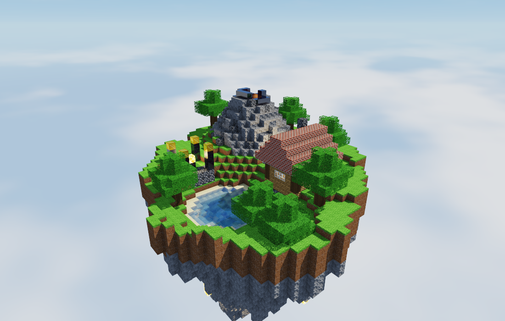
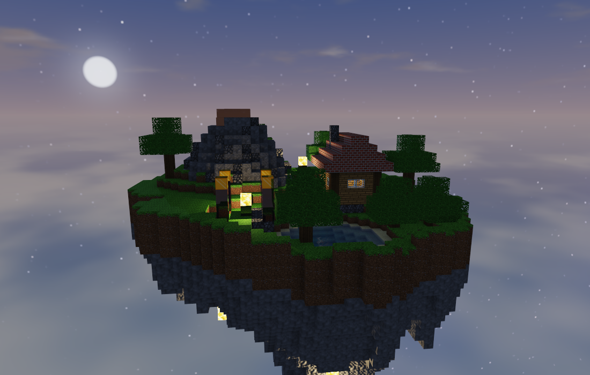
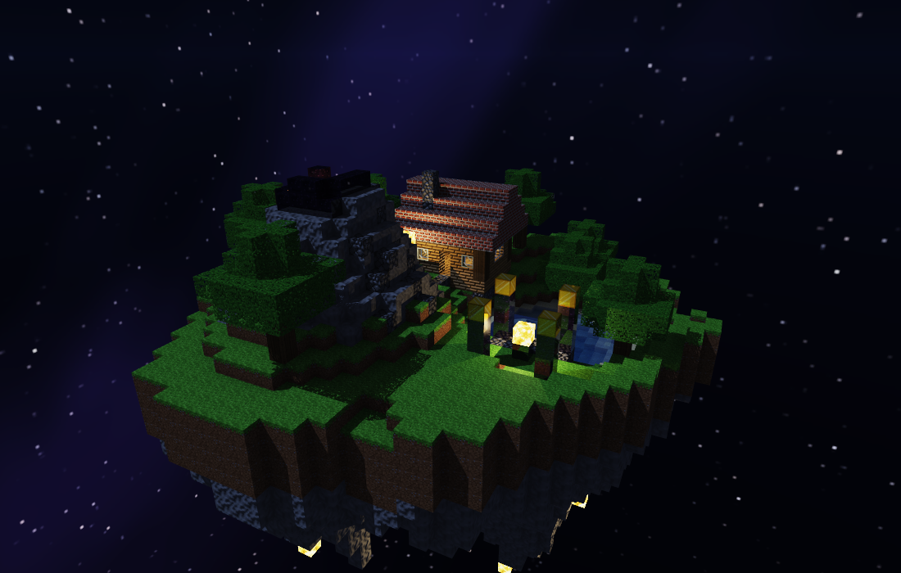
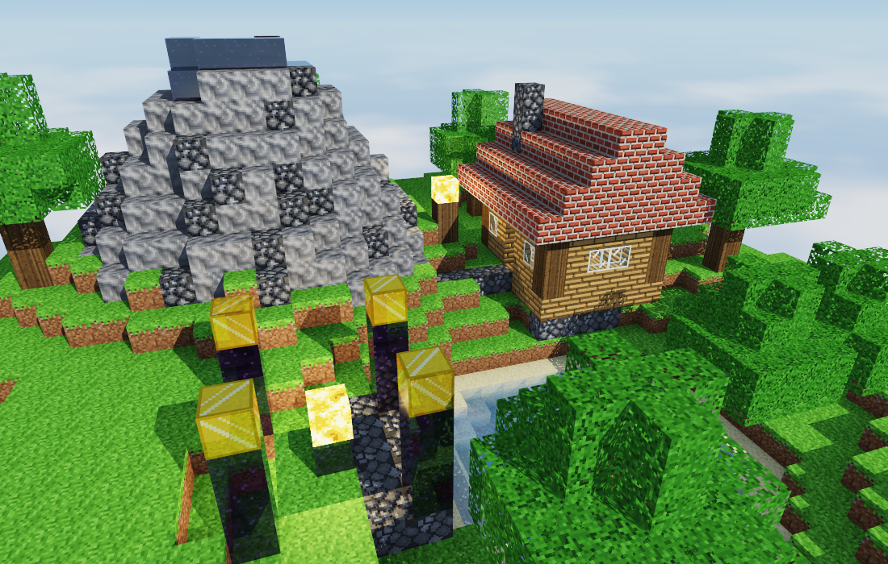
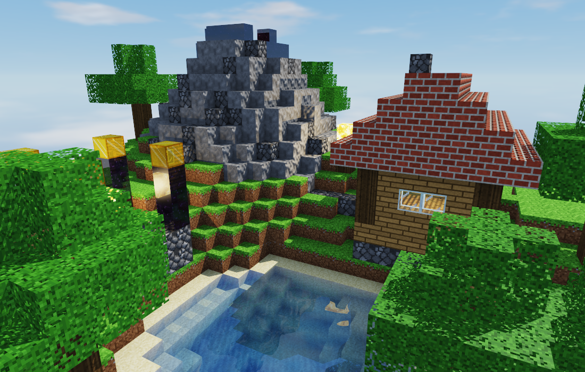

# Proyecto 2 — Diorama con raytracing

Una isla flotante hecha de cubos, renderizada con un raytracer propio que corre solo en CPU.
Tiene un volcán con lava, un lago, una cabaña con ventanas de vidrio, un altar de obsidiana y oro,
árboles y cristales luminosos colgando por debajo. El terreno se genera con ruido, así que cada
semilla da una isla distinta.


## Video

> _pendiente: aquí va el video del diorama_

## Capturas

| | |
|---|---|
|  |  |
|  |  |



## Cómo correrlo

Hace falta Rust. La única dependencia es raylib, que se usa para abrir la ventana, leer el teclado
y cargar los PNG. Todo lo demás (vectores, ruido, intersecciones, hilos) está hecho a mano con la
librería estándar.

```bash
cargo run --release
```

Hay que correrlo desde la raíz del repo porque las texturas se buscan en `assets/`.
En modo debug funciona pero va muy lento.

### Controles

| Tecla | Qué hace |
|---|---|
| `A` / `D` o flechas | girar alrededor de la isla |
| `W` / `S` o flechas | subir y bajar la cámara |
| `Q` / `E` o rueda del mouse | acercar y alejar |
| arrastrar con clic izquierdo | girar libremente |
| `Espacio` | activar o parar el giro automático |
| `T` | activar o parar el ciclo de día y noche |
| `Z` / `X` | atrasar o adelantar la hora |
| `R` | generar otra isla (semilla nueva) |
| `1` `2` `3` | resolución mientras la escena se mueve (completa, mitad, un tercio) |
| `P` | guardar una captura en `capturas/` |
| `H` | mostrar u ocultar el panel de ayuda |

Cuando nada se mueve (giro y ciclo apagados) la imagen pasa a resolución completa y se va afinando
sola: cada cuadro suma una muestra más por pixel y los bordes quedan suaves.

### Opciones de línea de comandos

```bash
cargo run --release -- --semilla 3 --hora 18.5
cargo run --release -- --foto salida.png --giro 4.4 --cabeceo 0.45 --zoom 22
cargo run --release -- --medir
cargo run --release -- --medir --hilos 1
```

`--foto` renderiza un cuadro a un PNG sin abrir ventana y `--medir` da una vuelta completa a la
isla y reporta los milisegundos por cuadro.

## Qué tiene

**Materiales.** Cada bloque tiene su textura de 16x16 y sus propios valores de albedo, especular,
transparencia y reflectividad (están en `src/materiales.rs`):

| Bloque | Albedo | Especular | Transparencia | Reflejo | Extra |
|---|---|---|---|---|---|
| Pasto | 0.95 | 0.03 | 0 | 0 | textura distinta arriba, a los lados y abajo |
| Tierra | 0.90 | 0.02 | 0 | 0 | |
| Piedra | 0.85 | 0.14 | 0 | 0 | mapa normal |
| Adoquín | 0.85 | 0.20 | 0 | 0 | mapa normal |
| Arena | 0.95 | 0.07 | 0 | 0 | |
| Agua | 0.50 | 0.90 | 0.90 | 0.10 | refracción (índice 1.33), oleaje |
| Vidrio | 0.90 | 1.00 | 0.95 | 0.08 | refracción (índice 1.5), marco opaco |
| Tronco | 0.85 | 0.04 | 0 | 0 | anillos en las tapas |
| Hojas | 0.90 | 0.08 | 0 | 0 | textura con huecos |
| Tablones | 0.90 | 0.10 | 0 | 0 | mapa normal |
| Ladrillo | 0.90 | 0.08 | 0 | 0 | mapa normal |
| Piedra luminosa | — | — | 0 | 0 | emisiva |
| Lava | — | — | 0 | 0 | emisiva |
| Obsidiana | 0.70 | 0.60 | 0 | 0.12 | refleja más de lado que de frente |
| Oro | 0.55 | 1.00 | 0 | 0.55 | reflejo teñido (metal) |

**Refracción.** El agua del lago y el vidrio de las ventanas doblan los rayos con la ley de Snell.
La mezcla entre lo reflejado y lo refractado sale de Fresnel (aproximación de Schlick), y dentro del
agua el color se va absorbiendo con la distancia, por eso lo hondo se ve más azul.

**Reflexión.** Los bloques de oro y los pilares de obsidiana del altar, y la superficie del lago.

**Mapas normales.** Piedra, adoquín, ladrillo y tablones. Se nota sobre todo en el techo de la
cabaña y en el volcán cuando la luz pega de lado.

**Materiales emisivos.** La lava del cráter y la piedra luminosa (la lámpara de la cabaña, el farol,
el centro del altar y los cristales de abajo). Además de verse brillantes funcionan como luces
puntuales con sombras; de noche son lo que alumbra la isla.

**Skybox.** Dos cubemaps, uno de día y otro de noche, que se mezclan según la hora. El sol y la luna
se dibujan encima en la dirección real de la luz.

**Terreno procedural.** La isla ocupa unos 35x35 cubos dentro de una grilla de 40x50x40. El relieve
sale de ruido fractal (value noise de 4 octavas), al que se le suma el cono del volcán y se le resta
la hondonada del lago. La parte de abajo también sale de ruido. La cabaña, el altar y los árboles se
acomodan según la semilla.

**Cámara.** Órbita alrededor de la isla con zoom.

**Otras cosas.** Sombras que se tiñen al pasar por agua o vidrio, oclusión ambiental en las esquinas
(como la iluminación suave de minecraft) y tone mapping para que la lava y el sol no se quemen.

## Rendimiento

Todo corre en CPU. Lo que más ayudó:

- **DDA sobre la grilla.** El rayo avanza de celda en celda (Amanatides y Woo) en vez de probarse
  contra cada cubo. El costo depende de cuántas celdas cruza, no de cuántos bloques hay.
- **Saltar el aire.** Cada celda vacía guarda a cuántas celdas está el bloque más cercano. Con eso
  el rayo salta de un solo paso todo el cubo de aire que tiene alrededor. También se recorta contra
  la caja que encierra la isla, así los rayos que solo ven cielo no entran a la grilla.
- **Hilos.** El lienzo se parte en tandas de 4 filas y los hilos (`std::thread::scope`) las van
  sacando de una cola compartida, así ninguno se queda sin trabajo aunque le toque una zona fácil.
- **Rayos que no valen la pena.** Los reflejos y refracciones llevan la cuenta de cuánto aportan al
  pixel y se cortan cuando ya casi no se notarían. Igual con los faroles lejanos a pleno sol.
- **Luces agrupadas.** Los bloques emisivos vecinos (toda la lava del cráter, por ejemplo) se juntan
  en una sola luz puntual.
- **Resolución según el movimiento.** Mientras la cámara se mueve se renderiza a media resolución;
  cuando se queda quieta pasa a completa y acumula muestras.
- **Tabla de gamma** en vez de tres `powf` por pixel.

Medido con `--medir` en mi máquina (16 hilos), vuelta completa de día a 550x350:

| | ms por cuadro |
|---|---|
| un hilo, sin saltar el aire | ~72 |
| un hilo | ~39 |
| 16 hilos | ~6 a 10 |

## Cómo está organizado

```
src/
  main.rs        ventana, controles y los modos --foto / --medir
  algebra.rs     Vec3 (sirve para posiciones y para colores)
  camara.rs      cámara orbital y rayos por pixel
  mundo.rs       la grilla de cubos y el recorrido DDA
  trazador.rs    sombreado: luces, sombras, reflexión, refracción, relieve
  materiales.rs  tipos de bloque y sus parámetros
  texturas.rs    carga de PNG y muestreo
  luces.rs       sol/luna según la hora y luces de los bloques emisivos
  boveda.rs      skybox
  ruido.rs       value noise y ruido fractal
  terreno.rs     generación de la isla
  obras.rs       cabaña, altar y árboles
  pintor.rs      reparto del render entre hilos
  lienzo.rs      framebuffer, acumulación y tone mapping
assets/
  texturas/      bloques de 16x16 y sus mapas normales
  cielo/         las 12 caras de los dos cubemaps
herramientas/    scripts con los que generé las texturas y el cielo
```

Las texturas y el cielo los generé yo con los scripts de `herramientas/` (Python, solo para crear
los PNG; el programa no los necesita para correr).
